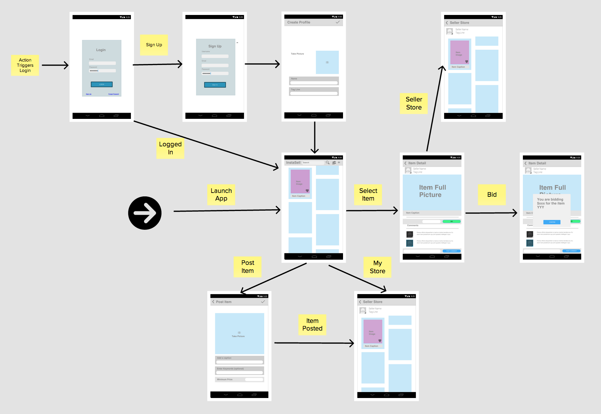
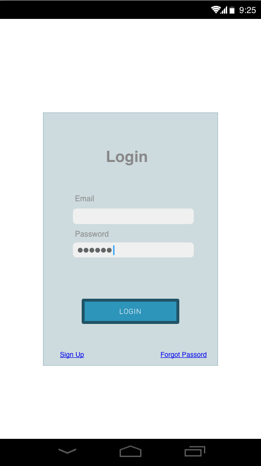
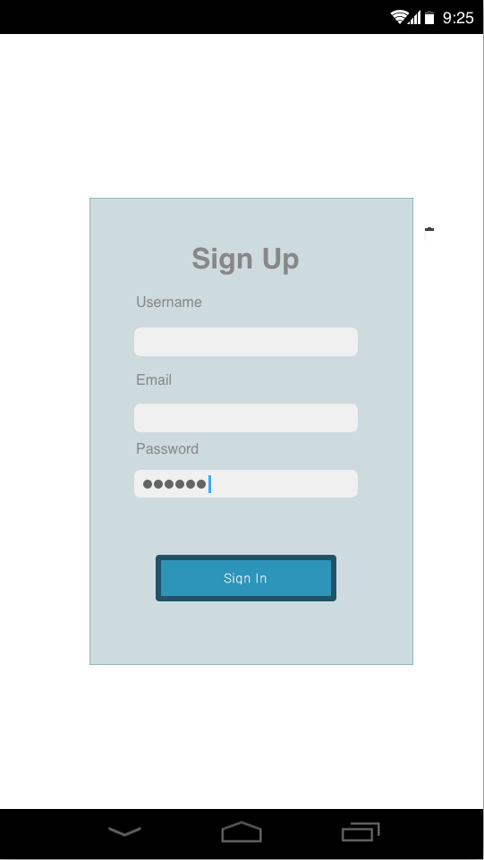
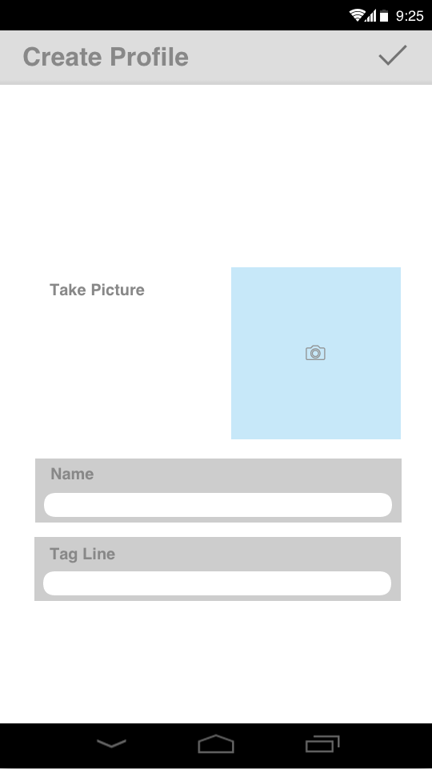
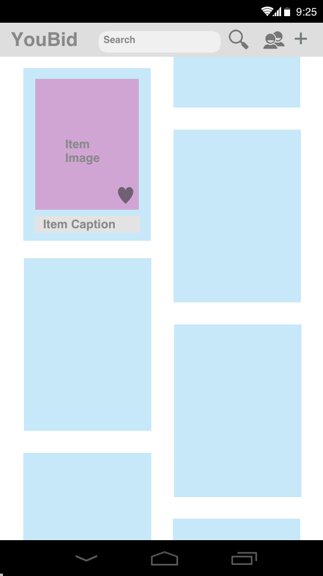
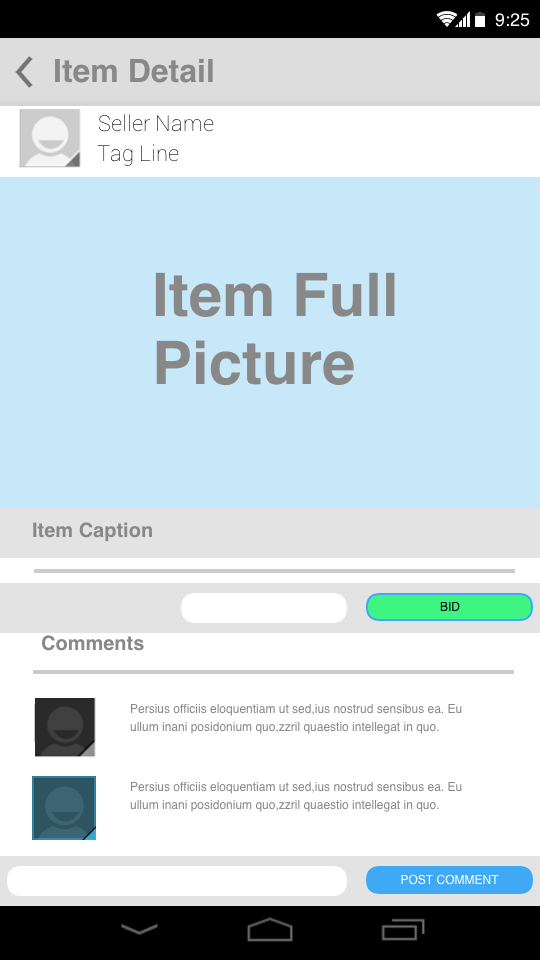
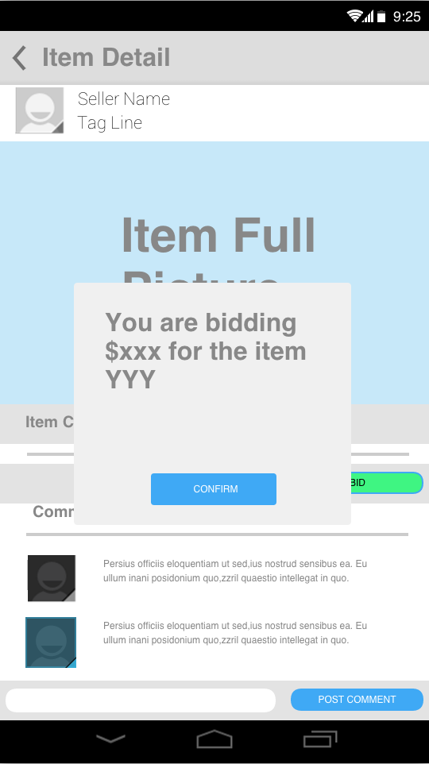
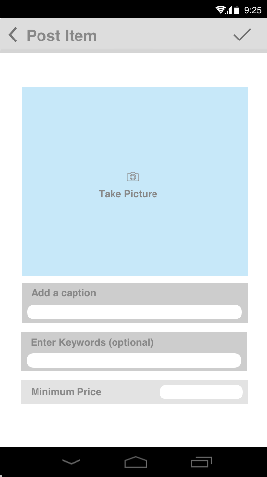
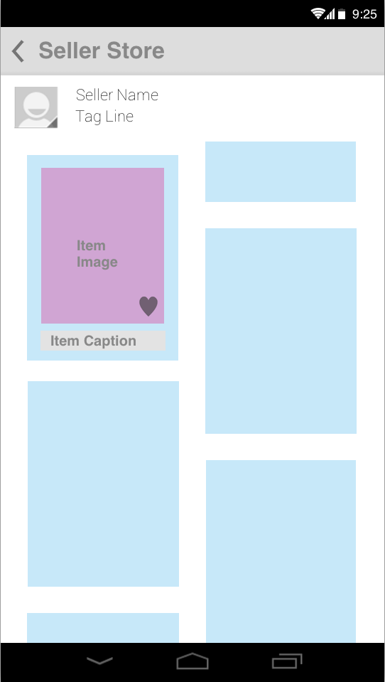

# Preliminary Scoping Outline

## Section A.

**Group Members:**

* Sreejumon KP <sreejumon@gmail.com>
* Shiva Sandeep Garlapati <shivagarlapati@gmail.com>
* Gabi Zuniga <gabiz@gapix.com>

**Mentor:** Vijay Sailappan <vijay.sailappan@gmail.com>

**App Name: YouBid**

**What problem does this app address:**

* Local sellers (neighbors selling used items or local shops) and service providers do not have a marketplace where they can offer their items or services without specifying a fix price. The seller might not have a price in mind or such price may fluctuate based on demand or availability. When setting a price the seller usually needs to compromise between his desired price and his lowest one. When setting a too high price then potential customers are missed. 

* Buyers do not have a fun and dynamic mobile application that allows them to browse for local deals on the go and make offers for items or services. Moreover today there is no way for a buyer to offer items they own for exchange.

**How does this app solve that problem:**

YouBid creates a new marketplace in which items for sale or services do not have associated sale prices but instead buyers make offers to sellers to acquire the items.

This structure lowers the seller friction by making posting an item for sale super simple. This encourages sellers to post many items which today do not have a marketplace. Such items are unlikely to be posted to Craigslist because it takes effort, it is not clear what price is fair and the items expire after a couple of weeks.

YouBid also lowers the friction for the buyer which feels more control and can offer anything they feel or are able to for the item. The buyer is able to comment and ask questions in an item feed which leverages the patters of successful social app.

The seller is able to specify to the system a minimum price below which the offer would be automatically rejected. A variable delay ranging from minutes to hours may be introduced to the automatic rejection to keep buyers from probing or annoying the seller.

**App Audience:**

* Local sellers with a mobile phone for posting items or services for sale.
* Local buyers looking for a specific item or just interested in searching for deals in the neighborhood or just curious of what neighbors or friends are selling.

**App Use cases**

1. Users login/register **(Login/Register)**
2. Post item for sale. **(Post Item for Sale)**
3. Feed with items for sale like Etsi. **(Browse/Search)**
4. Buyer can post a private offer for an item for sale.  **(Post Offer)**
5. Post and read comments  **(Detail/Comments)**
6. Browse user store. **(Store)**
7. Multiple items selction from same store (seller), and offering bid (similar to garage sale experience) **(Store)**
8. Social network integration (facebook & Twitter) & Share **(Social Integration)**

## Section B.

**Steps for Login/Register:**
* User authentication is required to do any operation other than browsing feeds / details. 
* User is presented with a registration/login screen. ~~On the first run the registration screen is shown by default. On consecutives runs the app will auto login, but if the user logged out then the login screen is presented.~~
* On registration the user is requested: username, password, profile picture, location. The user is also asked to select categories of interest which will be used to populate its main item feed, similarly to Pinterest.
* Login screen requests: username and password.
* A forgot my password button is also presented to reset password.

**Steps for Post Item for Sale:**
* Display a screen including the following fields: caption, picture, optional autorejection price.
* Optionally (stretch goal) the sellers are presented with an option to use photo filters like instagram for making beautiful pictures.
* Seller fills information and presses post button to post.
* Following post, the details/comments screen of the item is presented and the seller can add comments in the feed if he/she wishes to add more details.

**Steps for Browse/Search:**
* The browse screen is the main screen of the app and it resembles the Etsi screen.
* Location slider shall be provided to limit the search result (eg:- 5 miles radious)
* The user is presented with a feed of items for sale for browsing. Each item includes a picture and a caption.
* When an item is selected then the details/comments screen is presented.
* This screen’s menu includes a search option to search for specific items or categories.

**Steps for Detail/Comments:**
* This screen shows the image and caption with full dimensions.
* It also has a comment feed with an edit text box in the bottom to post comments similar to social apps.
* The menu of this screen has an offer button to post a private offer to the seller.

**Steps for Post Offer:**
* This screen has a field to enter the amount to offer for the item and a field for adding additional information to be sent to the user by email.

## Section C.

**Checklist of screens needed:**

* Splash (optional)
* Registration screen
* Login screen
* Post Item for Sale screen
* Item Feed screen
* Comment screen
* Store screen

**Requirements Checklist:**

Must have **at least** three separate "activities" or screens supporting user interaction

* The project has a total of 6 separate acitvities.

Must be **data-driven** with dynamic information or media being displayed

* All user, inventory and user comments is data driven with dynamic information stored in the cloud. We will use Parse as the primary backend technology for the project.

Must use a **RESTful API** to source the data that is populated into the application

* While Parse precludes the need of interacting with a backend using RESTful API, it allows creating REST endpoints with 
“Cloud Code”. Specific functionality like comment feeds can be implemented using RESTful apis serviced by Parse. 
* In addition we can use AWS S3’s REST api for storing BLOBS in the cloud.

Must use **local persistence** either through files, preferences or SQLite

* All data will be persisted in SQLite for offline viewing.

## Section D.

**Wireframes**

**Screens Action Flow**

**Login**

**Sign Up**

**Create Profile**

**Home Feed**

**Item Detail**

**BidConfirm**

**Post Item**

**Seller Store**

